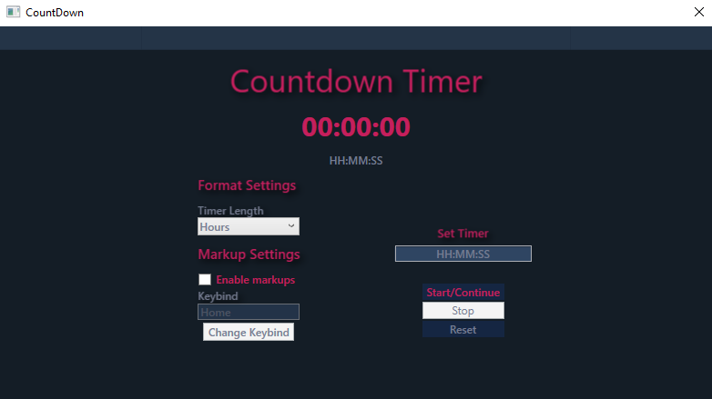
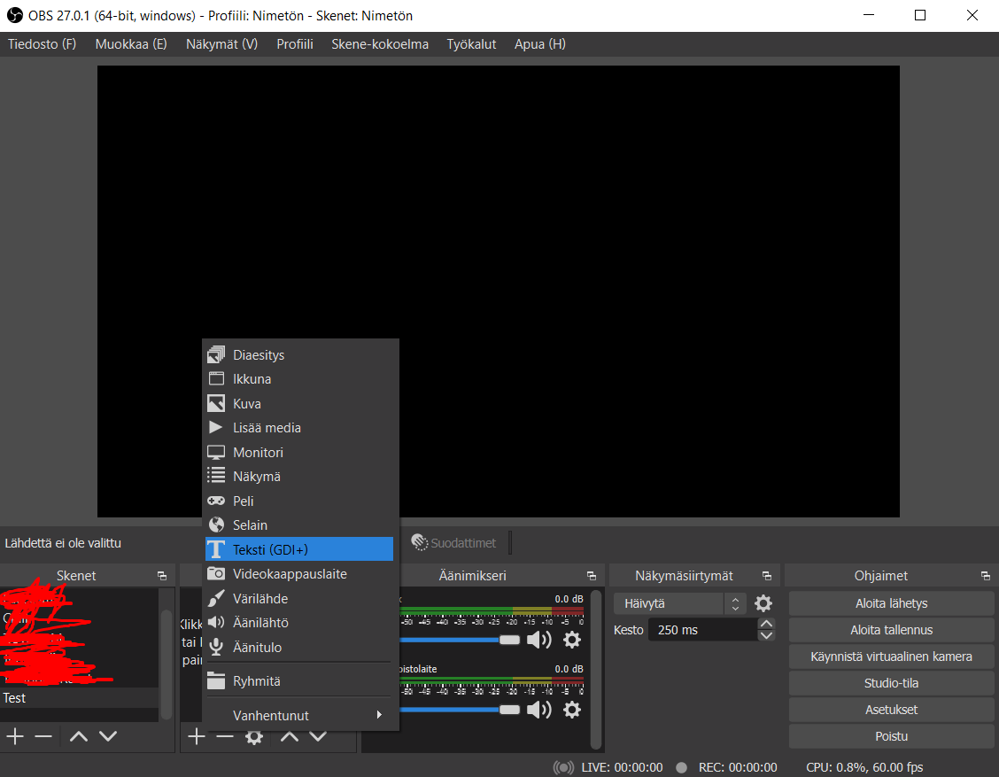
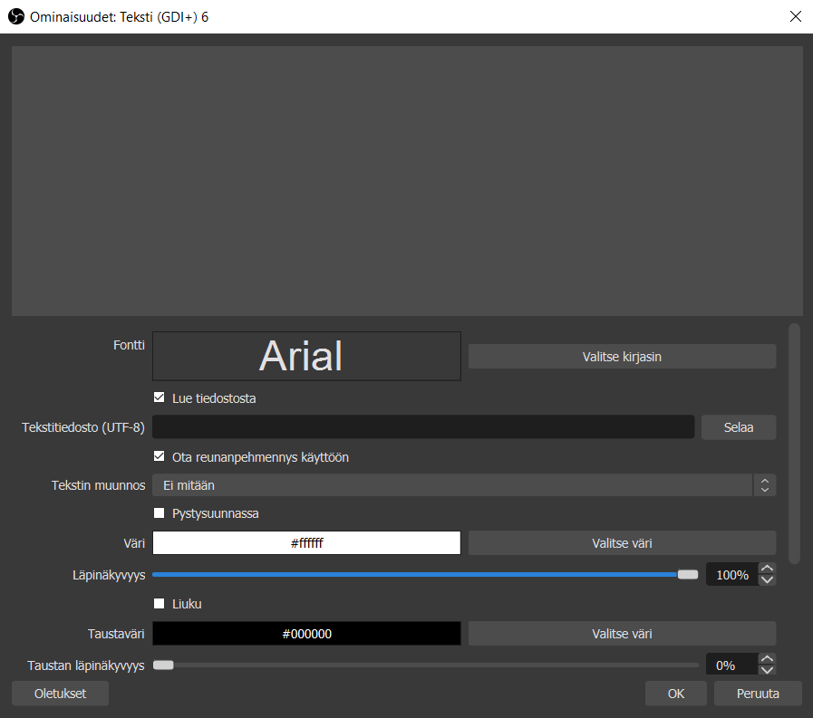

# CountdownForStreams
Stream Challenge countdown software made with C#/WPF.
<h3>Usage</h3>

<b>Working with the timer</b>

Starting the timer is really self explanatory. Select the time format you want to use for the timer. After that write in the time you want to countdown from. Press start :)

To stop the timer simply press the stop button. If you want to reset everything press reset. 

<b>Adding the timer to OBS</b>

1. Open obs and add a new text source like this

2. After adding the text source right click on it and select properties. In the properties there should be a checkbox "Read from a file". Click that and a box to select a file should appear. 

3. Click the browse button and find the folder where you have the Countdown.exe installed. Now when you start the timer there should appear a folder named "txt. Inside there should be a "Time.txt" file. Select that file and press "Open". Now the timer should be shown in the text. Press OK and there you have it!

<b>Markup stream highlights easily!</b>

If you want to markup the highlights of your stream into a txt file check the "Enable Markups" box to turn it on! You can define your custom hotkey that you would like to use for the markup. The markup feature captures the current time on the countdown and saves it into a file. It captures the keystroke globally so it works while you are playing any games thanks to Larry57:s repository here: https://gist.github.com/Larry57/5365740. After you are done with the stream you can check the marked up times in the txt folder which we looked at in the Obs timer setup. The txt file is named "Markup.txt".

<b>Happy streaming :)</b>
